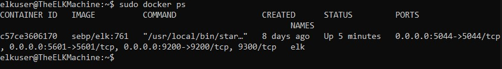

## Automated ELK Stack Deployment

The files in this repository were used to configure the network depicted below.

These files have been tested and used to generate a live ELK deployment on Azure. They can be used to either recreate the entire deployment pictured above. Alternatively, select portions of the .yml file may be used to install only certain pieces of it, such as Filebeat.

elkbook.yml - used to install the ELK server

This document contains the following details:
- Description of the Topologu
- Access Policies
- ELK Configuration
  - Beats in Use
  - Machines Being Monitored
- How to Use the Ansible Build

### Description of the Topology

The main purpose of this network is to expose a load-balanced and monitored instance of DVWA, the D*mn Vulnerable Web Application.

Load balancing ensures that the application will be highly available,in addition to restricting inbound access to the network.
With load balancers, they protect the network from DDoS attacks vy shifting the attack traffic from a corporate server to a cloud provider.
With a Jump Box, it has one origination point for administrative tasks that sets the Jump Box as a Secure Admin Workstation.

Integrating an ELK server allows users to easily monitor the vulnerable VMs for changes to the file systems of the VMs on the network and system system metrics.

Filebeat helps generate and organize the log files to send to Logstash and ElasticSearch. It logs information about the file system.
Metricbeat collects metrics and statstics and ships them to an output from either Elasticsearch or Logstash.

The configuration details of each machine may be found below.

| Name       | Function 		    | IP Address | Operating System |
|------------|------------------------------|------------|------------------|
| Jump Box   | Gateway  		    | 10.0.0.1   | Linux            |
| Web-1      | Web Server - Docker - DVWA   | 10.0.0.7   | Linux            |
| Web-2      | Web Server - Docker - DVWA   | 10.0.0. 6  | Linux            |
| ELK Server | ELK Stack                    | 10.1.0.4   | Linux            |

### Access Policies

The machines on the internal network are not exposed to the public Internet. 

Only the Jump Box machine can accept connections from the Internet. Access to this machine is only allowed from the following IP addresses:
- My Personal IP Address

Machines within the network can only be accessed by each other.
- The Jump Box is the only machine that can access the ELK-Server via SSH from a my personal IP address.

A summary of the access policies in place can be found in the table below.

| Name     | Publicly Accessible | Allowed IP Addresses |
|----------|---------------------|----------------------|
| Jump Box | Yes                 | 10.0.0.4 Personal IP |
| ELK      | No                  | 10.0.0.4 Personal IP |
| Web-1    | No                  | 10.0.0.7             |
| Web-2    | No                  | 10.0.0.6             |

### Elk Configuration

Ansible was used to automate configuration of the ELK machine. No configuration was performed manually, which is advantageous because...
- It allows the user to automate the installing process so that we can establish multiple machines easily without having to physically set up a new machine.

The playbook implements the following tasks:
- Install Docker
- Download Image
- Conmfigure the container
- Create playbook to install container with docker
- Run the playbooks to launch the container

The following screenshot displays the result of running `docker ps` after successfully configuring the ELK instance.

### Target Machines & Beats
This ELK server is configured to monitor the following machines:
- Web-1 : 10.0.0.7
- Web-2 : 10.0.0.6

We have installed the following Beats on these machines:
- Filebeat
- Metricbeat

These Beats allow us to collect the following information from each machine:
- Filebeat: Filebeat detects changes within the filesystem to collect APache logs.
- Metricbeat: Metricbeat detects cahnges in the system metris like CPU usuage. It allows us to detect when there is a failed SSH login attempts or CPU statistics.

### Using the Playbook
In order to use the playbook, you will need to have an Ansible control node already configured. Assuming you have such a control node provisioned: 

SSH into the control node and follow the steps below:
- Copy the install_filebeat.yml file to /etc/ansible/roles.
- Update the filebeat-config.yml file to include the ELK server private IP in lines 1106 and 1806.
- Run the filebeat-playbook, and navigate to the kibana page to check that the installation worked as expected.

- _Which file is the playbook?_
   elkplaybook.yml
   install_filebeat.yml
   install_metricbeat/yml
- _Where do you copy it?_
   /etc/ansible
- _Which file do you update to make Ansible run the playbook on a specific machine? How do I specify which machine to install the ELK server on versus which to install Filebeat on?_
   /etc/ansible/hosts.cfg
   In /etc/ansible/hosts/ the user will specify where you want the playbook to be installed.
- _Which URL do you navigate to in order to check that the ELK server is running?_
   http://MyPersonalIP:5601/app/kibana#/home

